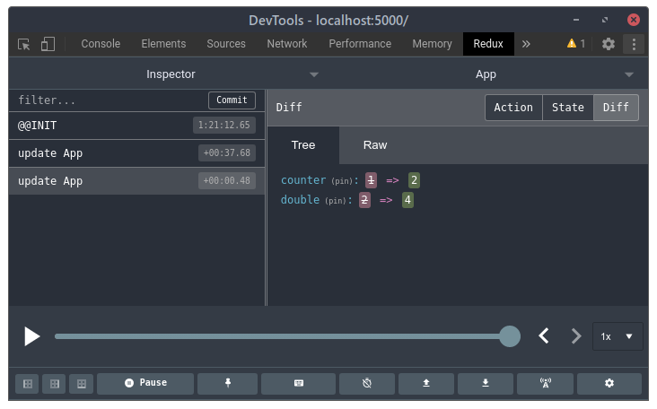
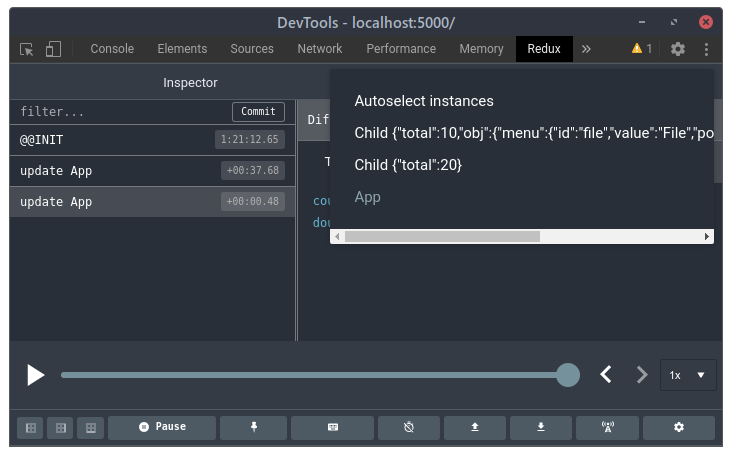
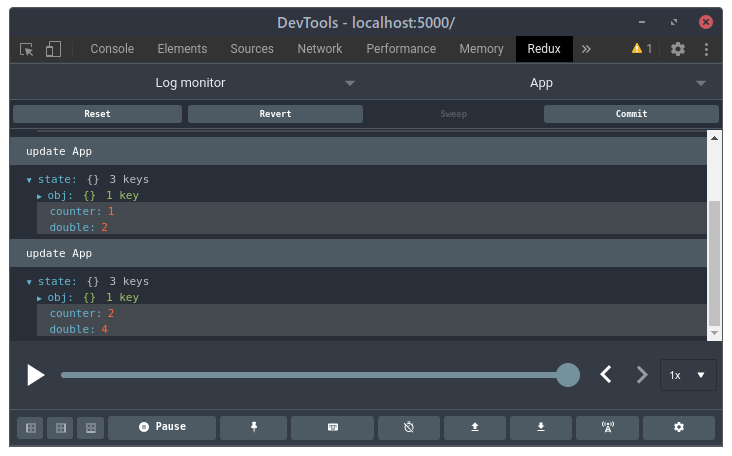

# svelte-watch

Monitor Svelte components state using Redux Devtools

## Installation

```bash
npm install svelte-watch
```

## Usage

Insert the following import in the entry file of your svelte app (the .js file)

```javascript
import "svelte-watch";
```

## Screenshots

### Event list


### Components list


### State log
